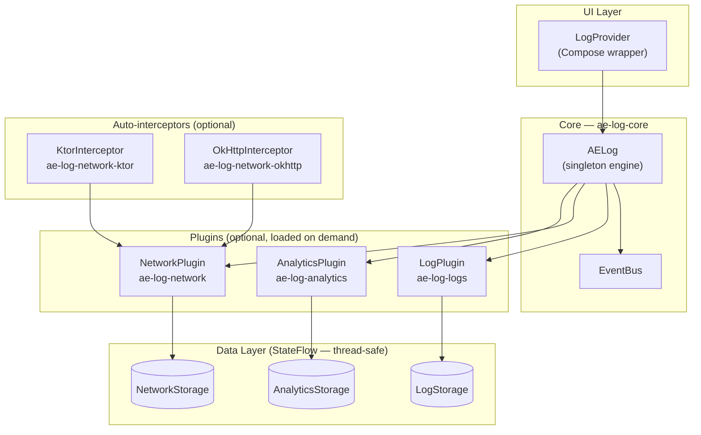

<h1 align="center">AELog</h1>

<p align="center">
  <strong>Extensible on-device dev tools for Kotlin Multiplatform</strong>
  <br />
  An in-app debugging overlay for KMP — inspect logs, network traffic, and analytics events with a beautiful Compose UI. No external tools needed.
</p>

<p align="center">
  <a href="https://central.sonatype.com/artifact/io.github.abdo-essam/ae-log-logs">
    
  </a>
  <a href="https://github.com/abdo-essam/AELog/actions/workflows/ci.yml">
    
  </a>
  <a href="https://codecov.io/gh/abdo-essam/AELog">
    
  </a>
  <a href="https://kotlin.github.io/binary-compatibility-validator/">
    
  </a>
  <a href="LICENSE">
    
  </a>
  <a href="https://kotlinlang.org">
    
  </a>
</p>

<p align="center">
  <a href="#-features">Features</a> •
  <a href="#-installation">Installation</a> •
  <a href="#-quick-start">Quick Start</a> •
  <a href="#-plugins">Plugins</a> •
  <a href="#-custom-plugins">Custom Plugins</a> •
  <a href="https://abdo-essam.github.io/AELog/">Documentation</a>
</p>

---

<p align="center">
  
  &nbsp;&nbsp;&nbsp;
  
</p>

## ✨ Features

| Feature | Description |
|---------|-------------|
| 🔍 **Log Inspector** | Search, filter, and copy logs with syntax-highlighted JSON |
| 🌐 **Network Viewer** | HTTP request/response inspection with method badges |
| 📊 **Analytics Tracker** | Monitor analytics events in real-time |
| 🎨 **Beautiful UI** | Material3 design with light/dark mode support |
| 🧩 **Plugin System** | Extend with custom debug panels through modular dependencies |
| 📱 **Adaptive Layout** | Bottom sheet on phones, dialog on tablets |
| 🔌 **Zero Release Overhead**| Disable with a single flag — no runtime cost |
| 🍎 **Multiplatform** | Android, iOS, Desktop (JVM), Web (WASM) |

## 📦 Installation

AELog is fully modularized. **You only add the artifact for the feature you need.**
Every plugin module carries its dependencies transitively, so you never need to add
`ae-log-core` or intermediate modules manually.

> **Pick your scenario below — copy only that block.**

---

### 🔵 Scenario A — Logs only

```kotlin
// build.gradle.kts
commonMain.dependencies {
    implementation("io.github.abdo-essam:ae-log-logs:1.0.3")
    // ↳ transitively includes ae-log-core
}
```

---

### 🌐 Scenario B — Network inspection with Ktor

```kotlin
// build.gradle.kts
commonMain.dependencies {
    implementation("io.github.abdo-essam:ae-log-network-ktor:1.0.3")
    // ↳ transitively includes ae-log-network and ae-log-core
}
```

---

### 🟢 Scenario C — Network inspection with OkHttp (Android only)

```kotlin
// build.gradle.kts
androidMain.dependencies {
    implementation("io.github.abdo-essam:ae-log-network-okhttp:1.0.3")
    // ↳ transitively includes ae-log-network and ae-log-core
}
```

---

### 📊 Scenario D — Analytics inspection

```kotlin
// build.gradle.kts
commonMain.dependencies {
    implementation("io.github.abdo-essam:ae-log-analytics:1.0.3")
    // ↳ transitively includes ae-log-core
}
```

---

### 🚀 Scenario E — Full stack (Logs + Network + Analytics)

For a KMP project with Ktor on all platforms and OkHttp on Android:

```kotlin
// build.gradle.kts (shared module)
kotlin {
    sourceSets {
        commonMain.dependencies {
            implementation("io.github.abdo-essam:ae-log-logs:1.0.3")
            implementation("io.github.abdo-essam:ae-log-network-ktor:1.0.3")
            implementation("io.github.abdo-essam:ae-log-analytics:1.0.3")
        }
        androidMain.dependencies {
            // Add this only if your Android target also uses OkHttp
            implementation("io.github.abdo-essam:ae-log-network-okhttp:1.0.3")
        }
    }
}
```

---

### 📖 Dependency map (full reference)

| Artifact | Transitively includes | Platform |
|---|---|---|
| `ae-log-logs` | `ae-log-core` | KMP |
| `ae-log-network` | `ae-log-core` | KMP |
| `ae-log-network-ktor` | `ae-log-network`, `ae-log-core` | KMP |
| `ae-log-network-okhttp` | `ae-log-network`, `ae-log-core` | Android |
| `ae-log-analytics` | `ae-log-core` | KMP |

### Version Catalog

```toml
[versions]
aelog = "1.0.3"

[libraries]
aelog-logs             = { module = "io.github.abdo-essam:ae-log-logs",           version.ref = "aelog" }
aelog-network-ktor     = { module = "io.github.abdo-essam:ae-log-network-ktor",   version.ref = "aelog" }
aelog-network-okhttp   = { module = "io.github.abdo-essam:ae-log-network-okhttp", version.ref = "aelog" }
aelog-analytics        = { module = "io.github.abdo-essam:ae-log-analytics",      version.ref = "aelog" }
```

## 🚀 Quick Start

### 1. Initialize & Install Plugins

Best called early in your platform-specific entry points (e.g. `Application.onCreate` for Android, or main `ViewController` for iOS):

```kotlin
AELog.init(
    LogPlugin(),      // Built-in log viewer
    NetworkPlugin(),   // Network inspector
    AnalyticsPlugin()  // Analytics tracker
)
```

### 2. Launch the UI

#### For Jetpack Compose Apps
Wrap your main content:

```kotlin
@Composable
fun App(debugMode: Boolean) {
    LogProvider(
        enabled = debugMode, // ← disables UI overhead in release builds
        uiConfig = UiConfig(
            showFloatingButton = true, // Enables the 'bug' overlay button
            enableLongPress = true,    // Show panel on 3-finger long press
        )
    ) {
        MaterialTheme {
            YourAppContent()
        }
    }
}
```

#### For Traditional View-Based Android Apps (XML)
No need to add Compose to your app! Just launch the built-in activity anywhere (like a developer menu button):

```kotlin
import com.ae.log.launchViewer
import com.ae.log.AELog

// Call from any Activity or Fragment
AELog.launchViewer(requireContext()) 
```

### 3. Log — primary API (`AELog`)

`AELog` is a discoverable object modelled after Android's built-in `Log` class.
Just type `AELog.` and the IDE lists every method — no extension hunting required:

```kotlin
AELog.log.v("Auth", "Token checked")
AELog.log.d("Auth", "Token refreshed")
AELog.log.i("HomeScreen", "App launched!")
AELog.log.w("Auth", "Session expiring soon")
AELog.log.e("Database", "Failed to clear cache", exception) // stack trace auto-appended
AELog.log.wtf("Auth", "Unexpected state")
```

> All calls are **silent no-ops** if `AELog.init()` has not been called yet — safe in shared modules that run before app startup.

#### Auto-tag — no tag required (recommended)

Omit the tag and AELog derives it from the caller's class name automatically. No repetition, no overhead:

```kotlin
AELog.log.d("Token refreshed")          // tag → "AuthViewModel"
AELog.log.i("App launched!")             // tag → "HomeScreen"
AELog.log.e("Failed to clear cache", t)  // tag → "Database"
```

```kotlin
// Network & Analytics APIs
AELog.network.logRequest(method = "GET", url = "https://api.example.com/users")
AELog.network.logResponse(url = "https://api.example.com/users", statusCode = 200)
AELog.analytics.logEvent("item_added_to_cart", properties = mapOf("id" to "123"))
```

### 🌐 Network Interceptors

AELog provides first-class interceptors for OkHttp and Ktor.

#### Security (Redaction)
Both interceptors are **secure by default**. They automatically redact sensitive headers like `Authorization` and `Cookie` to prevent token leakage in logs.

```kotlin
// OkHttp
val interceptor = OkHttpInterceptor(
    redactHeaders = setOf("X-Sensitive-Header") // Extends default redactions
)

// Ktor
val client = HttpClient {
    install(KtorInterceptor) {
        redactHeaders = setOf("X-Api-Key")
    }
}
```

#### Body Truncation (OOM Prevention)
To prevent memory issues when inspecting large payloads (e.g., file uploads), bodies are automatically truncated (default 250 KB).

```kotlin
OkHttpInterceptor(
    maxRequestBodyBytes = 500_000,  // 500 KB limit
    maxResponseBodyBytes = 1_000_000 // 1 MB limit
)
```

#### Ktor Response Body Capture
By default, Ktor response streams can only be read once. To enable non-destructive inspection of response bodies:
1. **Install DoubleReceive**: It is highly recommended to install the `DoubleReceive` plugin in your `HttpClient`.
2. **Integrated Fallback**: AELog will attempt to capture the body using `bodyAsText()`. If `DoubleReceive` is not installed, this may consume the stream—ensure your app logic is compatible or use the recommended plugin.

```kotlin
val client = HttpClient {
    install(DoubleReceive) // Recommended for Network Plugin
    install(KtorInterceptor)
}
```

### 4. Open AELog

Three ways to open the inspector:
1. Tap the floating **bug button** (bottom-right corner)
2. Long-press with multiple fingers anywhere on screen (if enabled)
3. Programmatically: `LocalLogController.current.show()`

## 🧩 Modularity & Available Plugins

| Module / Plugin | Class | Description |
|--------|------|-------------|
| `:ae-log-core` | - | Infrastructure, EventBus, and UI Shell |
| `:ae-log-logs` | `LogPlugin` | Log viewer with severity filters (ALL / VERBOSE / DEBUG / INFO / WARN / ERROR) |
| `:ae-log-network` | `NetworkPlugin` | HTTP inspector with method badges, status filtering (2xx / 4xx / 5xx) and full body view |
| `:ae-log-analytics` | `AnalyticsPlugin` | Analytics tracker separating Screens / Events with expandable properties |

## 🔨 Custom Plugins

Create your own debug panel (e.g., a Database Inspector or Feature Flags toggler) in 3 steps:

```kotlin
class FeatureFlagsPlugin : UIPlugin {
    override val id = "feature_flags"
    override val name = "Flags"
    override val icon = Icons.Default.Flag

    private val _badgeCount = MutableStateFlow<Int?>(null)
    override val badgeCount: StateFlow<Int?> = _badgeCount

    override fun onAttach(context: PluginContext) {
        // Initialize your plugin (observe context.scope, context.eventBus, etc.)
    }

    @Composable
    override fun Content(modifier: Modifier) {
        // Your Compose UI here
        LazyColumn(modifier = modifier) {
            items(flags) { flag ->
                FlagRow(flag)
            }
        }
    }
}

// Install it
AELog.init(LogPlugin(), FeatureFlagsPlugin())
```

📖 See the [Custom Plugins Guide](https://abdo-essam.github.io/AELog/custom-plugins) for the full API reference.

## 🔗 Logging Integrations

AELog works with **any** logging setup — just forward your log calls to the AELog API:

```kotlin
// Forward any log call directly — no bridge library needed
AELog.log(
    severity = LogSeverity.INFO,
    tag = "MyTag",
    message = "Something happened",
    throwable = null, // stack trace is appended automatically when present
)
```

📖 See the [Logging Integrations Guide](https://abdo-essam.github.io/AELog/integrations) for adapter examples (Kermit, Napier, Timber, SLF4J).

## 🏗️ Architecture

The SDK follows an encapsulated `Model-Store-API-UI` pattern, making plugins 100% reactive, modular, and thread-safe.



## 📋 Requirements

| Platform | Minimum Version |
|----------|----------------|
| Android | API 24 (Android 7.0) |
| iOS | 15.0 |
| Kotlin | 2.2.0+ |
| Compose Multiplatform | 1.7.3+ |

## 🤝 Contributing

Contributions are welcome! Please read the [Contributing Guide](CONTRIBUTING.md) first.

```bash
git clone https://github.com/abdo-essam/AELog.git
cd AELog
./gradlew build
./gradlew allTests
```

## 📄 License

```text
Copyright 2026 Abdo Essam

Licensed under the Apache License, Version 2.0 (the "License");
you may not use this file except in compliance with the License.
You may obtain a copy of the License at

    http://www.apache.org/licenses/LICENSE-2.0
```

## 💖 Acknowledgements

- Jetpack Compose — UI toolkit
- Kotlin Multiplatform — Cross-platform framework
