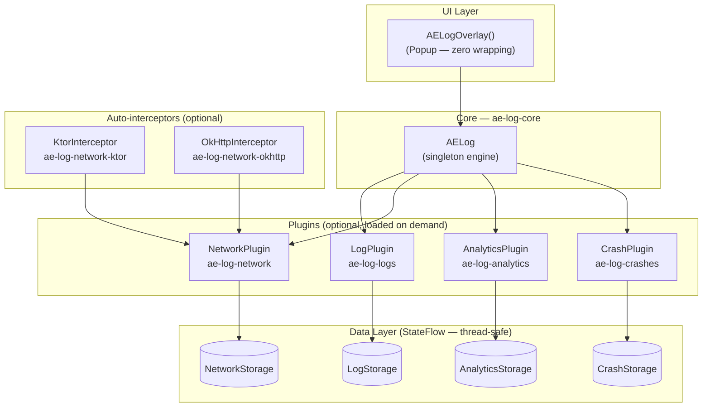

<h1 align="center">
  
  AELog
</h1>

<p align="center">
  <strong>Extensible on-device dev tools for Kotlin Multiplatform</strong>
  <br />
  An in-app debugging overlay for KMP — inspect logs, network traffic, and analytics events with a beautiful Compose UI. No external tools needed.
</p>

<p align="center">
  <a href="https://central.sonatype.com/artifact/io.github.abdo-essam/ae-log-logs">
    
  </a>
  <a href="https://github.com/abdo-essam/AELog/actions/workflows/ci.yml">
    
  </a>
  <a href="https://codecov.io/gh/abdo-essam/AELog">
    
  </a>
  <a href="https://kotlin.github.io/binary-compatibility-validator/">
    
  </a>
  <a href="LICENSE">
    
  </a>
  <a href="https://kotlinlang.org">
    
  </a>
</p>

<p align="center">
  <a href="#-features">Features</a> •
  <a href="#-installation">Installation</a> •
  <a href="#-quick-start">Quick Start</a> •
  <a href="#-plugins">Plugins</a> •
  <a href="#-custom-plugins">Custom Plugins</a> •
  <a href="https://abdo-essam.github.io/AELog/">Documentation</a>
</p>

---

<p align="center">
  
  &nbsp;&nbsp;&nbsp;
  
</p>

## ✨ Features

| Feature | Description |
|---------|-------------|
| 🔍 **Log Inspector** | Search, filter, and copy logs with syntax-highlighted JSON |
| 🌐 **Network Viewer** | HTTP request/response inspection with method badges |
| 📊 **Analytics Tracker** | Monitor analytics events in real-time |
| 💥 **Crash Reporter** | Capture and persist fatal and non-fatal exceptions on device |
| 🎨 **Beautiful UI** | Material3 design with light/dark mode support |
| 🧩 **Plugin System** | Extend with custom debug panels through modular dependencies |
| 📱 **Adaptive Layout** | Bottom sheet on phones, dialog on tablets |
| 🔌 **Zero Release Overhead**| Disable with a single flag — no runtime cost |
| 🍎 **Multiplatform** | Android, iOS, Desktop (JVM), Web (WASM) |

## 📦 Installation

AELog is fully modularized. **Add only the dependencies you need.** Every plugin module carries its dependencies transitively, so you never need to import `ae-log-core` manually.

### 1. Version Catalog (Recommended)

Add the following to your `gradle/libs.versions.toml`:

```toml
[versions]
aelog = "1.0.9"

[libraries]
aelog-logs             = { module = "io.github.abdo-essam:ae-log-logs",           version.ref = "aelog" }
aelog-network-ktor     = { module = "io.github.abdo-essam:ae-log-network-ktor",   version.ref = "aelog" }
aelog-network-okhttp   = { module = "io.github.abdo-essam:ae-log-network-okhttp", version.ref = "aelog" }
aelog-analytics        = { module = "io.github.abdo-essam:ae-log-analytics",      version.ref = "aelog" }
aelog-crashes          = { module = "io.github.abdo-essam:ae-log-crashes",        version.ref = "aelog" }
```

### 2. Gradle Setup

Add the required dependencies to your target source sets in `build.gradle.kts`:

```kotlin
// build.gradle.kts (shared module)
kotlin {
    sourceSets {
        commonMain.dependencies {
            // Pick only what you need (each carries core transitively)
            implementation(libs.aelog.logs)
            implementation(libs.aelog.network.ktor)
            implementation(libs.aelog.analytics)
            implementation(libs.aelog.crashes)
        }
        androidMain.dependencies {
            // Add only if your Android target uses OkHttp
            implementation(libs.aelog.network.okhttp)
        }
    }
}
```

---

📖 See the [Full Installation Guide](https://abdo-essam.github.io/AELog/) for direct dependency coordinates and details on transitive inclusions.

## 🚀 Quick Start

### 1. Zero-Config (Automatic Setup)
AELog features **zero-config auto-initialisation** on Android! Just add the Gradle dependencies for the plugins you want, and AELog automatically boots up with default settings when your app launches. **No setup or initialization code is required.**

### 2. Custom Configuration (Optional)
If you want to adjust global settings (like disabling the floating trigger notch globally) or configure capacity limits on built-in plugins, call `AELog.configure { }` from your platform entry point (e.g. `Application.onCreate()` for Android):

```kotlin
AELog.configure {
    // Disable the floating notch globally across XML & Compose screens (defaults to true)
    showNotch = false 
    
    // Customize capacity limits or other settings for specific plugins
    plugin(LogPlugin(maxEntries = 2_000))
    plugin(NetworkPlugin(maxEntries = 1_000))
}
```

### 3. Drop in the Overlay

#### For Compose Apps (Android & iOS)
Add `AELogOverlay()` as a **sibling** anywhere in your root composable — no wrapping required:

```kotlin
@Composable
fun App() {
    AELogOverlay() // ← Renders floating center-right notch + inspector panel as a Popup above your UI
    MaterialTheme {
        YourAppContent()
    }
}
```

To **disable the library in release builds**, set:
```kotlin
AELog.isEnabled = BuildConfig.DEBUG
```

To **hide the floating notch trigger** locally but still open the panel programmatically:
```kotlin
AELogOverlay(showNotch = false)
// Then trigger from a custom button or shake gesture:
AELog.show()
```

### 4. Log — primary API (`AELog`)

`AELog` is a discoverable object modelled after Android's built-in `Log` class.
Just type `AELog.` and the IDE lists every method — no extension hunting required:

```kotlin
AELog.log.v("Auth", "Token checked")
AELog.log.d("Auth", "Token refreshed")
AELog.log.i("HomeScreen", "App launched!")
AELog.log.w("Auth", "Session expiring soon")
AELog.log.e("Database", "Failed to clear cache", exception) // stack trace auto-appended
AELog.log.wtf("Auth", "Unexpected state")
```

> All calls are **silent no-ops** if the library hasn't initialized yet — safe to call from shared modules before app startup.

#### Auto-tag — no tag required (recommended)

Omit the tag and AELog derives it from the caller's class name automatically. No repetition, no overhead:

```kotlin
AELog.log.d("Token refreshed")          // tag → "AuthViewModel"
AELog.log.i("App launched!")             // tag → "HomeScreen"
AELog.log.e("Failed to clear cache", t)  // tag → "Database"
```

```kotlin
// Network, Analytics & Crashes APIs
AELog.network.logRequest(method = "GET", url = "https://api.example.com/users")
AELog.network.logResponse(url = "https://api.example.com/users", statusCode = 200)
AELog.analytics.logEvent("item_added_to_cart", properties = mapOf("id" to "123"))

// Capture non-fatal exceptions manually
try {
    performDangerousWork()
} catch (t: Throwable) {
    AELog.crashes.recordNonFatal(t)
}
```

### 🌐 Network Interceptors

AELog provides first-class interceptors for OkHttp and Ktor.

#### Security (Header Exclusion)
Both interceptors are **secure by default**. They automatically exclude sensitive headers like `Authorization` and `Cookie` to prevent credentials from appearing in logs.

```kotlin
// OkHttp
val interceptor = AELogOkHttpInterceptor(
    excludeHeaders = setOf("X-Sensitive-Header") // Extends default exclusions
)

// Ktor
val client = HttpClient {
    install(AELogKtorInterceptor) {
        excludeHeaders = setOf("X-Api-Key")
    }
}
```

#### Body Truncation (OOM Prevention)
To prevent memory issues when inspecting large payloads (e.g., file uploads), bodies are automatically truncated (default 250 KB).

```kotlin
AELogOkHttpInterceptor(
    maxRequestBodyBytes = 500_000,  // 500 KB limit
    maxResponseBodyBytes = 1_000_000 // 1 MB limit
)
```

#### Ktor Response Body Capture
By default, Ktor response streams can only be read once. To enable non-destructive inspection of response bodies:
1. **Install DoubleReceive**: It is highly recommended to install the `DoubleReceive` plugin in your `HttpClient`.
2. **Integrated Fallback**: AELog will attempt to capture the body using Ktor's internal stream handlers. If `DoubleReceive` is not installed, this may consume the stream—ensure your app logic is compatible or use the recommended plugin.

```kotlin
val client = HttpClient {
    install(DoubleReceive) // Recommended for Network Plugin
    install(AELogKtorInterceptor)
}
```

### 5. Open AELog

Three ways to open the inspector:
1. Tap the **floating notch** at the top of the screen (Dynamic Island-style)
2. Programmatically from anywhere: `AELog.show()` / `AELog.hide()`
3. Wire it to any custom trigger (shake gesture, debug menu button, etc.)

## 🔨 Custom Plugins

Create your own debug panel (e.g., a Database Inspector or Feature Flags toggler) in 3 steps:

```kotlin
class FeatureFlagsPlugin : UIPlugin {
    override val name = "Flags"
    override val icon: @Composable () -> Unit = { Icon(Icons.Default.Flag, contentDescription = null) }

    // Optional: Live badge count shown on the tab (omit if not needed)
    private val _badgeCount = MutableStateFlow(0)
    override val badgeCount: StateFlow<Int> = _badgeCount

    @Composable
    override fun Content(modifier: Modifier) {
        // Your Compose UI here (owns the entire panel layout)
        LazyColumn(modifier = modifier) {
            items(flags) { flag ->
                FlagRow(flag)
            }
        }
    }
}

// Install your custom plugin alongside the auto-registered ones
AELog.install(FeatureFlagsPlugin())
```

📖 See the [Custom Plugins Guide](https://abdo-essam.github.io/AELog/custom-plugins) for the full API reference.

## 🔗 Logging Integrations

AELog works with **any** logging library. Just forward logs to the static `AELog.log` methods:

```kotlin
// Forward logs using the static shorthands directly
AELog.log.i("MyTag", "Something happened")
AELog.log.e("Database", "Failed to clear cache", exception)
```

📖 See the [Logging Integrations Guide](https://abdo-essam.github.io/AELog/integrations) for adapter examples (Kermit, Napier, Timber, SLF4J).

## 🏗️ Architecture

The SDK follows an encapsulated `Model-Store-API-UI` pattern, making plugins 100% reactive, modular, and thread-safe.



## 🤝 Contributing

Contributions are welcome! Please read the [Contributing Guide](CONTRIBUTING.md) first.

```bash
git clone https://github.com/abdo-essam/AELog.git
cd AELog
./gradlew build
./gradlew allTests
```

## 📄 License

```text
Copyright 2026 Abdo Essam

Licensed under the Apache License, Version 2.0 (the "License");
you may not use this file except in compliance with the License.
You may obtain a copy of the License at

    http://www.apache.org/licenses/LICENSE-2.0
```

## 💖 Acknowledgements

- Jetpack Compose — UI toolkit
- Kotlin Multiplatform — Cross-platform framework

