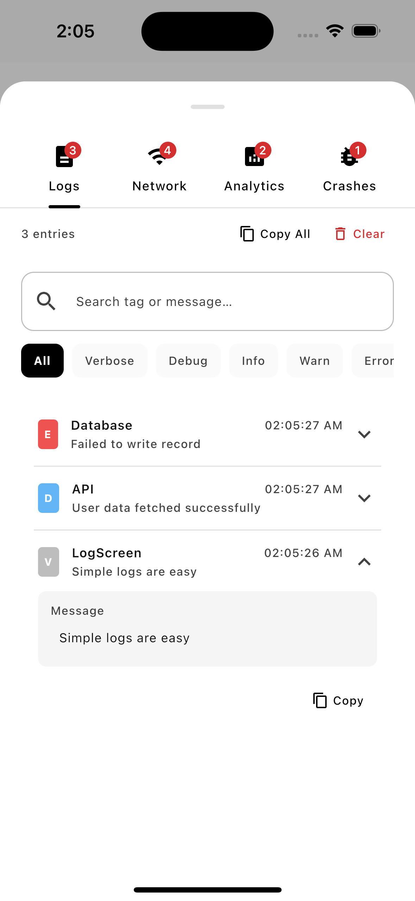
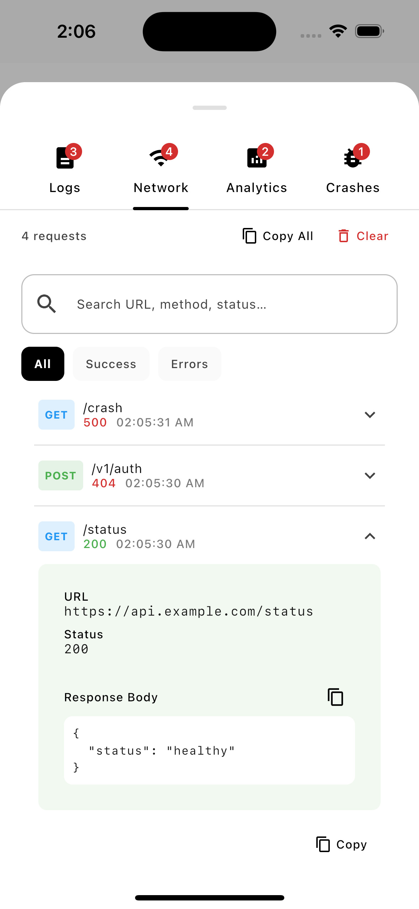
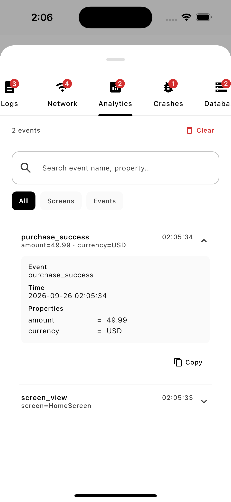
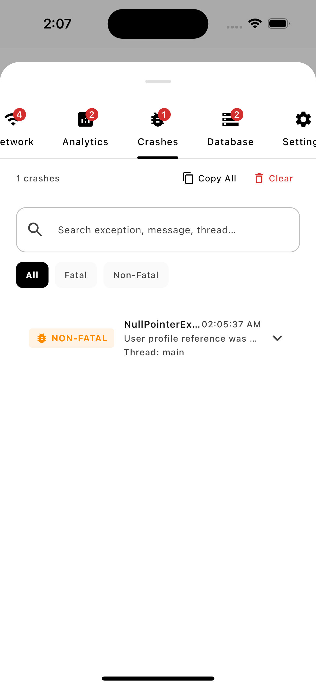
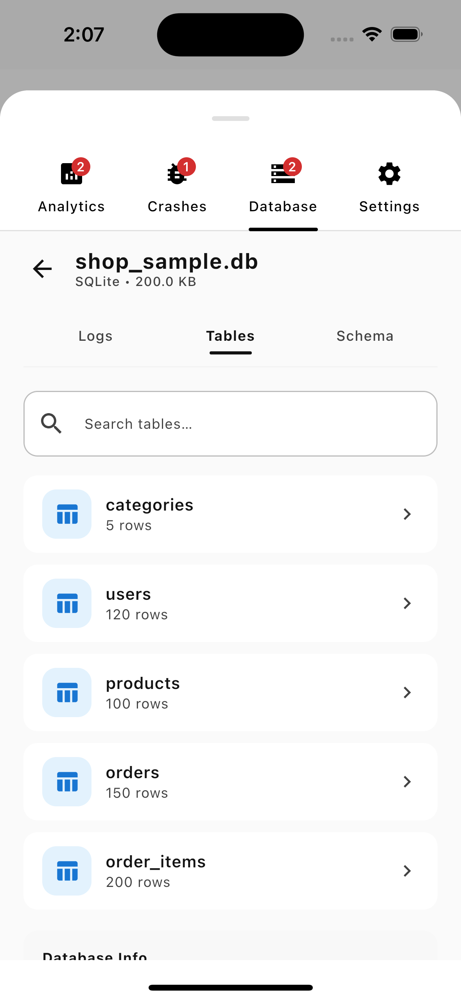

<p align="center">
  
</p>

<h1 align="center">AELog</h1>

<p align="center">
  <strong>Extensible on-device dev tools for Kotlin Multiplatform</strong>
  <br />
  An in-app debugging overlay for KMP — inspect logs, network traffic, analytics, crashes, and SQLite databases with a beautiful Compose UI. No external tools needed.
</p>

<p align="center">
  <a href="https://central.sonatype.com/artifact/io.github.abdo-essam/ae-log-logs">
    
  </a>
  <a href="https://github.com/abdo-essam/AELog/actions/workflows/ci.yml">
    
  </a>
  <a href="https://codecov.io/gh/abdo-essam/AELog">
    
  </a>
  <a href="https://kotlin.github.io/binary-compatibility-validator/">
    
  </a>
  <a href="LICENSE">
    
  </a>
  <a href="https://kotlinlang.org">
    
  </a>
  <a href="https://coderabbit.ai">
    
  </a>
</p>

<p align="center">
  <a href="#-features">Features</a> •
  <a href="#-core-plugins">Plugins</a> •
  <a href="#-installation">Installation</a> •
  <a href="#-quick-start">Quick Start</a> •
  <a href="#-custom-plugins">Custom Plugins</a> •
  <a href="https://abdo-essam.github.io/AELog/">Documentation</a>
</p>

---

<p align="center">
  
  &nbsp;&nbsp;
  
  &nbsp;&nbsp;
  
</p>
<p align="center">
  
  &nbsp;&nbsp;
  
</p>

## ✨ Highlights

- 🌐 **Kotlin Multiplatform & Wasm** — Seamless support for **Android**, **iOS**, **JVM / Desktop**, and **WebAssembly (`wasmJs`)**.
- 🎨 **Adaptive Dark & Light Themes** — Auto-adapts to system theme or forced via in-app Settings.
- 🚀 **Zero-Config Auto-Initialization** — Bootstraps automatically on Android (`ContentProvider`) and iOS (`@EagerInitialization`) without boilerplate.
- 🪟 **Floating Notch Trigger** — Movable, floating notch trigger that stays accessible across screens.
- 📦 **Modular Plugin Architecture** — Pay only for what you use with transitive dependency inheritance.

## ✨ Core Plugins

AELog provides a suite of modular core plugins:

| Plugin | Purpose | Key Capabilities |
|:---|:---|:---|
| 🔍 **Log Inspector** | On-Device Log Viewer | Live console output, search queries, filter by severity level/tag, auto-class tagging, copy/share. |
| 🌐 **Network Viewer** | HTTP Traffic Inspector | Ktor and OkHttp interception, full headers, status codes, JSON payload inspection with sensitive key redaction. |
| 📊 **Analytics Tracker** | Analytics Event Tracker | Track event dispatches, screen views, and custom property dictionaries in real time. |
| 💥 **Crash Reporter** | Local Exception Manager | Intercept fatal exceptions and record non-fatal errors on-device that survive app restarts. |
| 🗄️ **Database Inspector** | SQLite & Room Inspector | Auto-discover databases, browse tables, search rows, inspect schemas, and execute SQL queries directly on-device. |

## 📦 Installation

AELog is fully modularized. **Add only the dependencies you need.** Every plugin module carries `ae-log-core` transitively.

### 1. Version Catalog (Recommended)

Add the following to your `gradle/libs.versions.toml`:

```toml
[versions]
aelog = "1.2.0"

[libraries]
aelog-logs             = { module = "io.github.abdo-essam:ae-log-logs",           version.ref = "aelog" }
aelog-network-ktor     = { module = "io.github.abdo-essam:ae-log-network-ktor",   version.ref = "aelog" }
aelog-network-okhttp   = { module = "io.github.abdo-essam:ae-log-network-okhttp", version.ref = "aelog" }
aelog-analytics        = { module = "io.github.abdo-essam:ae-log-analytics",      version.ref = "aelog" }
aelog-crashes          = { module = "io.github.abdo-essam:ae-log-crashes",        version.ref = "aelog" }
aelog-database         = { module = "io.github.abdo-essam:ae-log-database",       version.ref = "aelog" }
aelog-database-room    = { module = "io.github.abdo-essam:ae-log-database-room",  version.ref = "aelog" }
```

### 2. Gradle Setup

Add the required dependencies to your target source sets in `build.gradle.kts`:

```kotlin
// build.gradle.kts (shared module)
kotlin {
    sourceSets {
        commonMain.dependencies {
            // Pick only what you need (each carries core transitively)
            implementation(libs.aelog.logs)
            implementation(libs.aelog.network.ktor)
            implementation(libs.aelog.analytics)
            implementation(libs.aelog.crashes)

            // Database Inspector:
            implementation(libs.aelog.database.room) // Room users
            // implementation(libs.aelog.database)    // SQLDelight / Raw SQLite users
        }
        androidMain.dependencies {
            // Optional OkHttp interceptor for Android
            implementation(libs.aelog.network.okhttp)
        }
    }
}
```

#### 🗄️ Database Plugin Selection

| Your Stack | Dependency to Add | Transitive Inclusions |
|:---|:---|:---|
| **androidx.room** | `libs.aelog.database.room` | Includes `aelog-database` & `ae-log-core` automatically. |
| **SQLDelight / Raw SQLite / Custom** | `libs.aelog.database` | Lightweight inspector without `androidx.room` dependencies. |

---

📖 See the [Full Installation Guide](https://abdo-essam.github.io/AELog/) for direct dependency coordinates and details.

## 🚀 Quick Start

### 1. Zero-Config Initialization
AELog features **zero-config auto-initialisation** on Android and iOS. Just add the Gradle dependencies for the plugins you want, and AELog automatically boots up when your app launches.

### 2. Drop in the Overlay

Add `AELogOverlay()` as a **sibling** anywhere in your root composable — no wrapping required:

```kotlin
@Composable
fun App() {
    // Renders the floating overlay trigger
    AELogOverlay() 
    
    MaterialTheme {
        Scaffold(
            floatingActionButton = {
                FloatingActionButton(onClick = { AELog.show() }) {
                    Icon(Icons.Default.BugReport, contentDescription = "Open Inspector")
                }
            }
        ) {
            YourAppContent()
        }
    }
}
```

To **disable the floating notch trigger** globally or locally:
```kotlin
AELog.showNotch = false // Disable globally
// or
AELogOverlay(showNotch = false) // Disable locally
```

To **disable the library entirely in release builds**:
```kotlin
AELog.isEnabled = BuildConfig.DEBUG
```

### 3. Log — Primary API (`AELog`)

`AELog` provides static shorthands modeled after Android's built-in `Log` class:

```kotlin
AELog.log.v("Auth", "Token checked")
AELog.log.d("Auth", "Token refreshed")
AELog.log.i("HomeScreen", "App launched!")
AELog.log.w("Auth", "Session expiring soon")
AELog.log.e("Database", "Failed to clear cache", exception)
AELog.log.wtf("Auth", "Unexpected state")
```

#### Auto-tagging (Tag Optional)

Omit the tag and AELog derives it from the caller's class name automatically:

```kotlin
AELog.log.d("Token refreshed")          // tag → "AuthViewModel"
AELog.log.i("App launched!")             // tag → "HomeScreen"
AELog.log.e("Failed to clear cache", t)  // tag → "Database"
```

```kotlin
// Network, Analytics & Crashes APIs
AELog.network.logRequest(method = "GET", url = "https://api.example.com/users")
AELog.network.logResponse(url = "https://api.example.com/users", statusCode = 200)
AELog.analytics.logEvent("item_added_to_cart", properties = mapOf("id" to "123"))

// Capture non-fatal exceptions manually
try {
    performDangerousWork()
} catch (t: Throwable) {
    AELog.crashes.recordNonFatal(t)
}
```

### 🌐 Network Interceptors

AELog provides first-class interceptors for OkHttp and Ktor.

#### Security (Header Exclusion)
Pass `InterceptorDefaults.COMMON_EXCLUDED` to hide sensitive headers like `Authorization` or `Cookie`:

```kotlin
// OkHttp
val interceptor = AELogOkHttpInterceptor(
    excludeHeaders = InterceptorDefaults.COMMON_EXCLUDED
)

// Ktor
val client = HttpClient {
    install(AELogKtorInterceptor) {
        excludeHeaders = InterceptorDefaults.COMMON_EXCLUDED + "X-Custom-Secret"
    }
}
```

#### Body Truncation
Bodies are automatically truncated (default 250 KB) to prevent memory issues:

```kotlin
AELogOkHttpInterceptor(
    maxRequestBodyBytes = 500_000,  // 500 KB limit
    maxResponseBodyBytes = 1_000_000 // 1 MB limit
)
```

#### Supabase Integration
```kotlin
val supabase = createSupabaseClient(url, key) {
    install(Auth)
    
    httpConfig {
        install(AELogKtorInterceptor)
    }
}
```

### 🗄️ Database Inspector & Query Adapter

AELog includes a powerful on-device Database Inspector with live query interception for **androidx.room**, **SQLDelight**, and **SQLite**.

#### 1. Room & SQLite Driver Interceptor (`setAELogDriver`)
To automatically intercept and log all SQL statements executed by your app in real-time, attach `setAELogDriver()` to your `RoomDatabase.Builder` or wrap your `SQLiteDriver` with `.withAELog()`:

```kotlin
// 1. Room Database Integration (aelog-database-room):
Room.databaseBuilder<AppDatabase>(name = dbFilePath)
    .setAELogDriver(BundledSQLiteDriver(), databaseName = "app.db")
    .build()

// 2. Raw SQLite / SQLDelight Integration (aelog-database):
val driver = BundledSQLiteDriver().withAELog(databaseName = "app.db")
```

#### 2. Auto-Discovery & Dependencies
On Android and iOS, AELog also automatically scans application database directories to browse tables and schemas:

```kotlin
// Room users (shared commonMain sourceSet)
implementation("io.github.abdo-essam:ae-log-database-room:1.2.0")

// SQLDelight / Raw SQLite users
implementation("io.github.abdo-essam:ae-log-database:1.2.0")
```

#### 3. Primary Database API (`AELog.database`)
Inspect databases, list tables, execute interactive SQL queries, or log custom app queries:

```kotlin
// List discovered databases
val databases = AELog.database.listDatabases()

// Browse database tables
val tables = AELog.database.listTables(dbName = "app.db")

// Execute interactive SQL queries
val result = AELog.database.query(
    dbName = "app.db",
    sql = "SELECT * FROM users WHERE active = 1"
)
```
// Log custom app database queries
AELog.database.logQuery(
    databaseName = "app_database.db",
    sql = "SELECT * FROM orders WHERE total > 100",
    durationMs = 3L
)
```

#### 3. Custom Configuration (`DatabasePluginConfig`)
Configure read/write security permissions, page sizes, and busy timeouts:

```kotlin
val dbConfig = DatabasePluginConfig(
    allowWrite = true,         // Enable INSERT, UPDATE, DELETE execution (default: false read-only)
    defaultPageSize = 100,     // Rows per page when browsing table data
    busyTimeoutMs = 5000L      // SQLite busy timeout in WAL mode
)

// Re-install DatabasePlugin with custom config
AELog.install(DatabasePlugin(config = dbConfig))
```

### 4. Opening AELog

Three ways to open the inspector:
1. Tap or drag the **floating notch** anywhere on the screen.
2. Programmatically from anywhere: `AELog.show()` / `AELog.hide()`
3. Wire to any custom trigger (shake gesture, debug menu button, etc.).

## 🔨 Custom Plugins

Create your own debug panel in 3 steps:

```kotlin
class FeatureFlagsPlugin : UIPlugin {
    override val name = "Flags"

    @Composable
    override fun Content(modifier: Modifier) {
        LazyColumn(modifier = modifier) {
            items(flags) { flag ->
                FlagRow(flag)
            }
        }
    }
}

// Install alongside auto-registered plugins
AELog.install(FeatureFlagsPlugin())
```

📖 See the [Custom Plugins Guide](https://abdo-essam.github.io/AELog/custom-plugins) for the full API reference.

## 🔗 Logging Integrations

Forward logs from Kermit, Napier, Timber, or SLF4J directly to `AELog.log`:

```kotlin
AELog.log.i("MyTag", "Something happened")
AELog.log.e("Database", "Failed to clear cache", exception)
```

📖 See the [Logging Integrations Guide](https://abdo-essam.github.io/AELog/integrations) for adapter details.

## 🤝 Contributing

Contributions are welcome! Please read the [Contributing Guide](CONTRIBUTING.md) first.

```bash
git clone https://github.com/abdo-essam/AELog.git
cd AELog
./gradlew build
./gradlew allTests
```

## 📄 License

```text
Copyright 2026 Abdo Essam

Licensed under the Apache License, Version 2.0 (the "License");
you may not use this file except in compliance with the License.
You may obtain a copy of the License at

    http://www.apache.org/licenses/LICENSE-2.0
```

## 💖 Acknowledgements

- Jetpack Compose — UI toolkit
- Kotlin Multiplatform — Cross-platform framework
